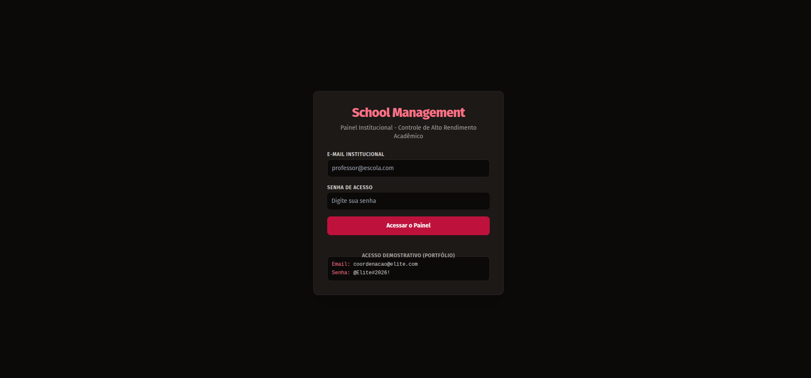
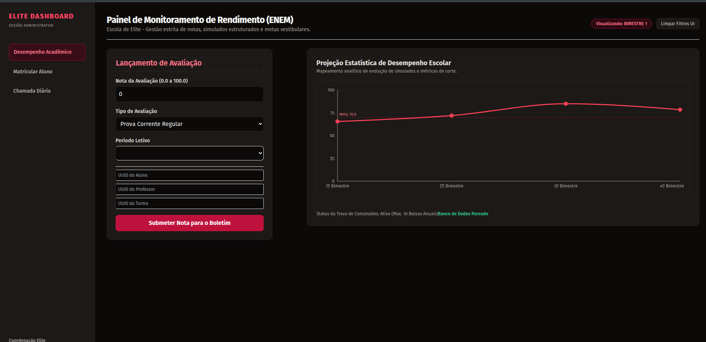
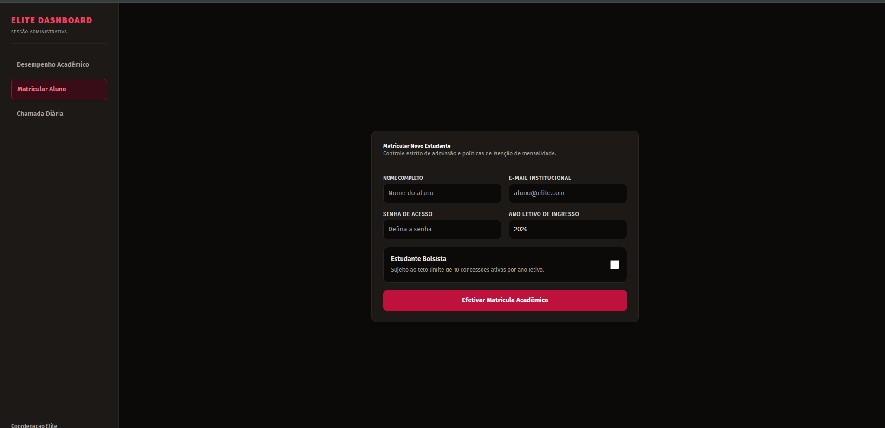
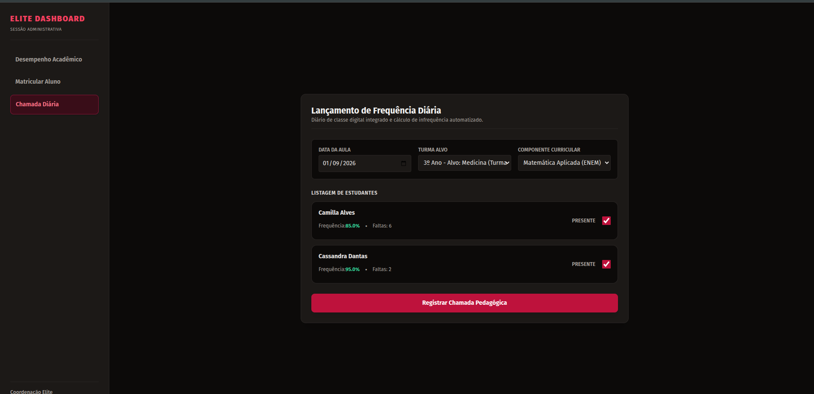

# 📊 School Management Dashboard - Escola de Elite

Um ecossistema Full-Stack de alta performance desenvolvido para gestão escolar pedagógica, governança administrativa e inteligência analítica de dados (Business Intelligence) [src].

## 🔗 Demonstração em Tempo Real

👉 **Acesse o sistema no ar:** [School Management Dashboard](https://school-management-dashboard-e20hso782-franferrazdev-projects.vercel.app/)

- \*\*E-mail de Acesso: `coordenacao@elite.com`
- **Senha Corporativa:** `@Elite#2026!`

---

## 📸 Demonstração Visual / Visual Presentation

### 1. Autenticação e Segurança Corporativa / Corporate Authentication

Acesso restrito via NextAuth com sessões criptografadas e controle de credenciais [src].

### 2. Painel de Business Intelligence / BI Analytics Panel

Exibição gráfica temporal do rendimento acadêmico na paleta corporativa em tons de vinho [src].

### 3. Controle Rígido de Bolsas / Enrollment & Scholarship Control

Formulário reativo com animações nativas do Tailwind, integrado à API de transações [src].

### 4. Diário de Classe e Monitoramento / Attendance tracking & Risk Monitoring

Cards automatizados que identificam estudantes com frequência abaixo de 75% [src].

---

## 🛠️ Tecnologias e Arquitetura do Ecossistema

- **Framework:** Next.js 14 (App Router) [src].
- **ORM & Banco de Dados:** Prisma 7 + PostgreSQL hospedado na nuvem pelo Supabase [src].
- **Estilização & Design:** Tailwind CSS + Recharts (Gráficos Reativos) [src]
- **Segurança & Validação:** NextAuth.js (sessões Criptografadas) + Zod v4 Core [src].

---

## Regras de Negócio Críticas Implementadas

1. **Trava de Governança Financeira:** O sistema príbe via transação atômica (`$transaction`) a concessão de mais de **10 bolsas de estudo ativas por ano letivo** [src].
2. **Idempotência de Chamadas:** A API impede folhas de presença duplicadas para a mesma turma/data através de travas com cláusulas de `upsert` [src].
3. **Alerta de Infrequência:** Cálculo automatizado em tempo de execução para sinalizar visualmente alunos sob risco de reprovação (presença < 75%) [src].

--- Schol Management Dashboard - English Version

A high-performance Full-Stack ecosystem built for pedagogical school management, administractive governance, and business intelligence (BI) data analytics [src].

## 🔗 Live Demo

👉 **Access the system online:** [School Management Dashboard](https://school-management-dashboard-e20hso782-franferrazdev-projects.vercel.app/)

- **Access Email:** `coordenacao@elite.com`
- **Corporate Password:** `@Elite#2026!`

---

## 📸 Visual Presentation

### 1. Corporate Authentication & Security

Restricted access via NextAuth featuring encrypted sessions and credential management [src].

### 2. BI Analytics Panel

Time-series visualization of academic performance using a corporate burgundy color palette [src].

### 3. Enrollment & Scholarship Control

Reactive form with native Tailwind animations, integrated with the transactions API [src].

### 4. Attendance Tracking & Risk Monitoring

Automated cards identifying students with attendance below 75% [src].

---

## 🛠️ Tech Stack and Architecture

- **Framework:** Next.js 14 (App Router) [src]
- **ORM & Database:** Prisma 7 + PostgreSQL hosted in the cloud via Supabase [src].
- **Styling & Design:** Tailwind CSS + Recharts (Reactive Charts) [src].
- **Security & Validation:** NextAuth.js (Encrypted Session) + Zod v4 Core [src].

---

## 🛑 Critical Business Rules Implemented

1. **Financial Governance Lock:** The system strictly blocks the granting of more than **10 active scholarships per academic year** using database atomic transactions (`$transaction`) [src].
2. **Roll Call Idempotency:** The server-side API prevents duplicate attendance sheets for the same class/date using operational `upsert` constraints [src].
3. **Infrequency Alert:** Real-time runtime computation triggers a deep-wine visual highlight on cards for students whose attendance drops **below 75%** (At Risk status) [src].
